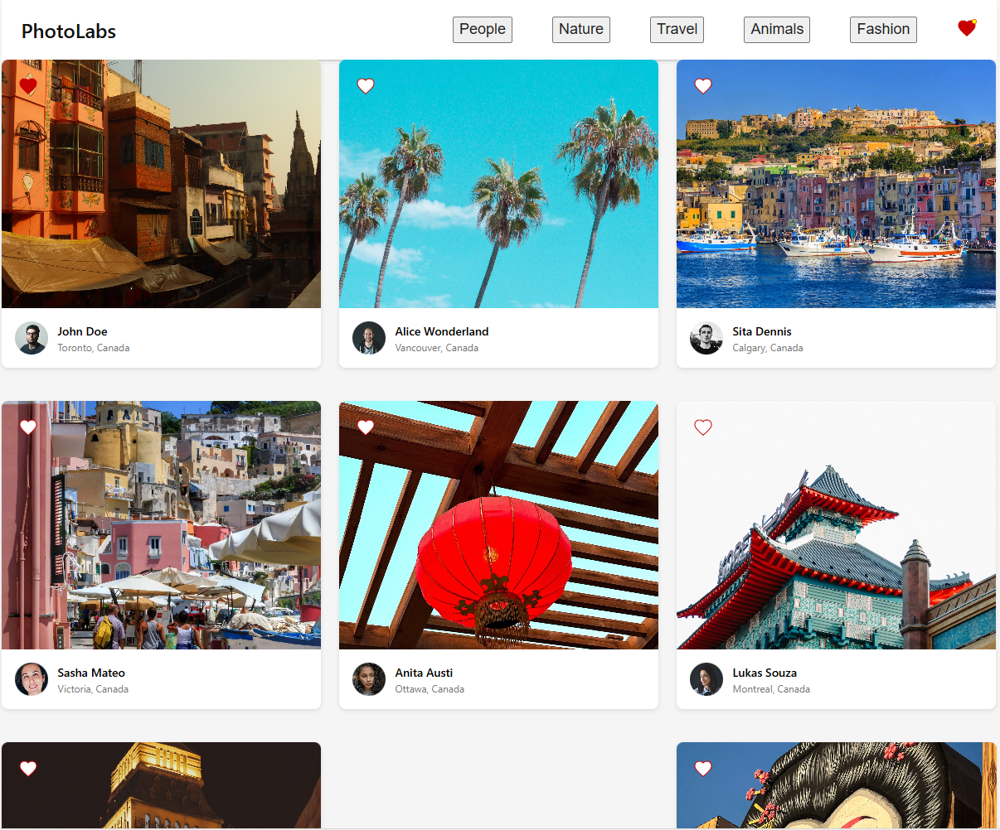
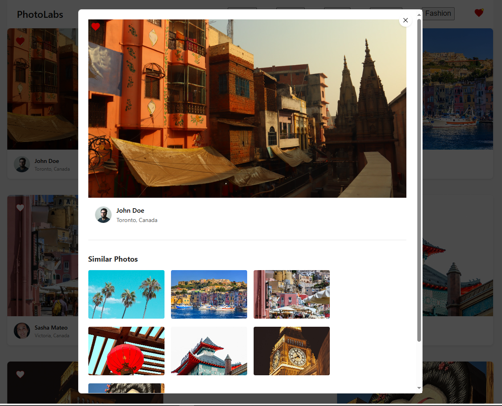
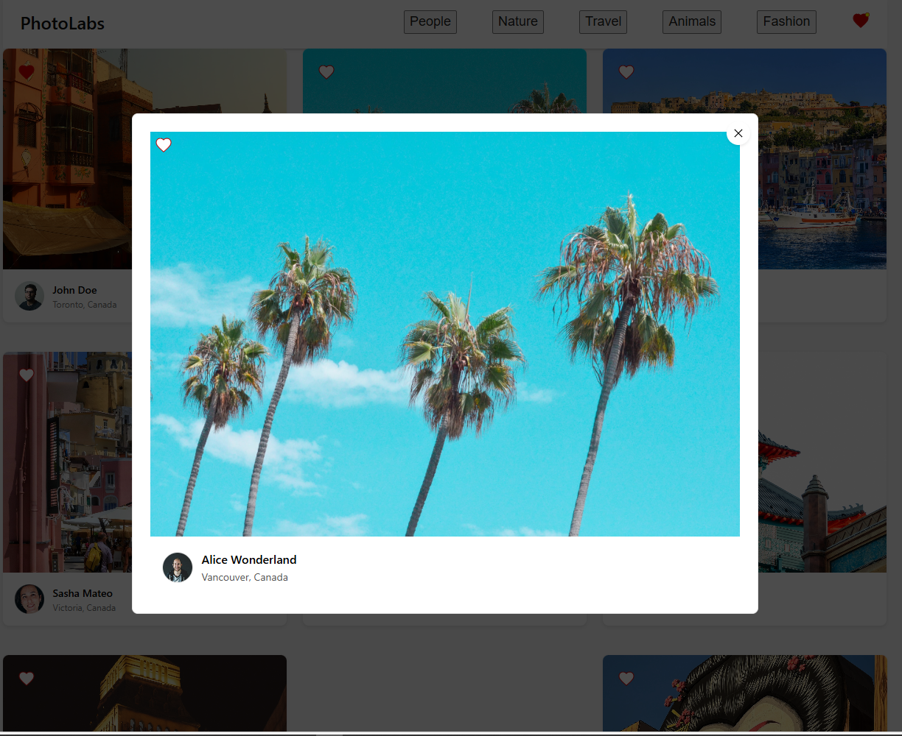
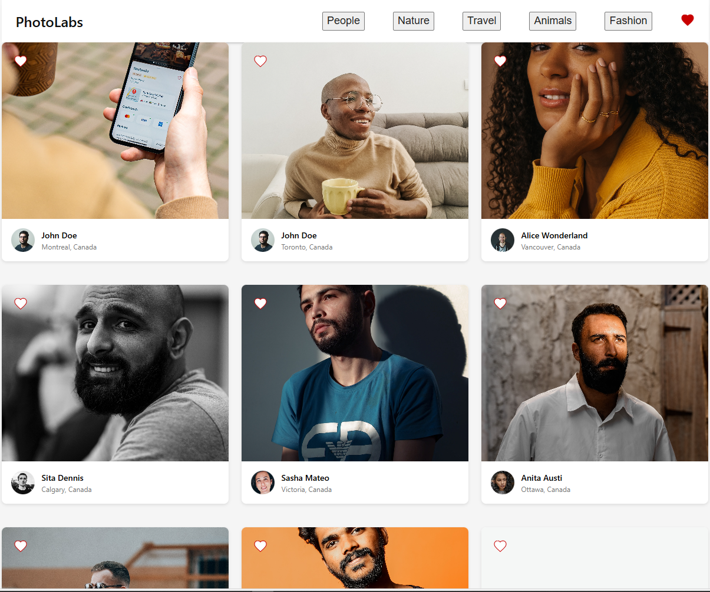
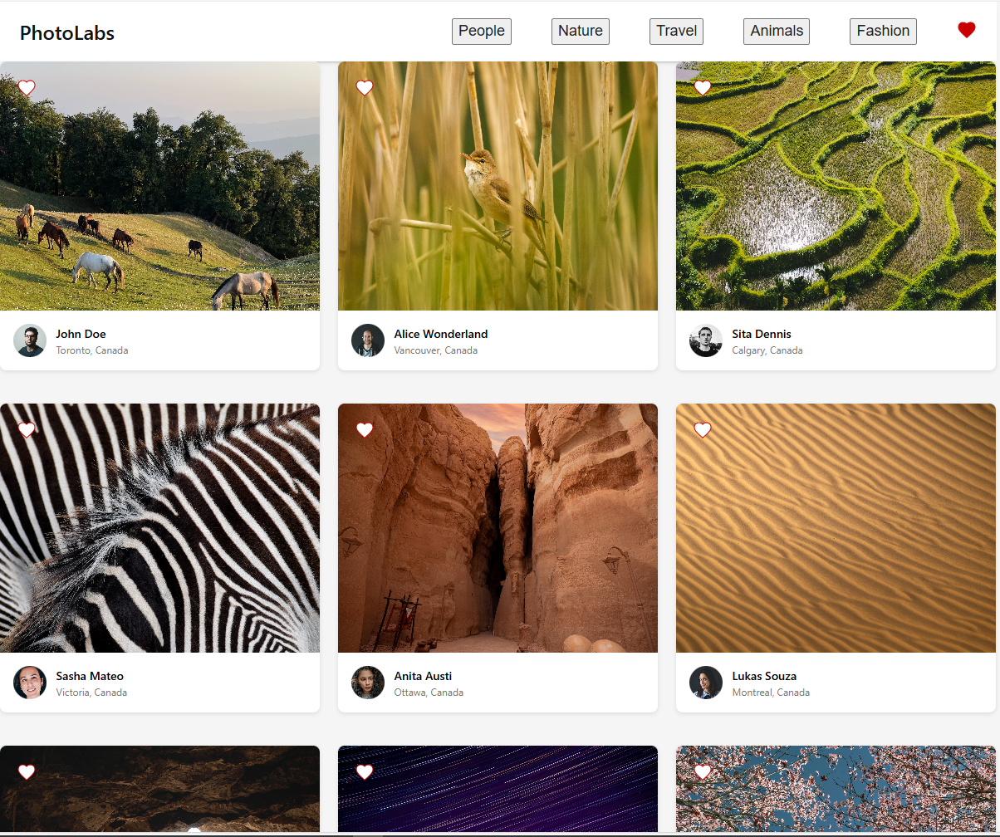

# PhotoLabs

PhotoLabs is a React-based single-page application (SPA) that allows users to view photos in different contexts. The application uses a pre-existing API to build a frontend user experience for interacting with photos.

## Features

- Photo browsing: Users can view a collection of photos on the homepage
- Topic navigation: Users can filter photos by different topics/categories
- Photo details: Users can click on photos to view them in a larger modal with additional information
- Favouriting: Users can mark photos as favorites and see a notification in the navigation bar
- Similar photos: When viewing a photo in detail, users can see and navigate to similar photos
- Responsive design: The application works on different screen sizes

## Setup

### Prerequisites
- Node.js (v14 or higher recommended)
- npm (v6 or higher)

### Installation

1. Clone this repository
   ```bash
   git clone <your-repo-url>
   cd photolabs

### Backend Setup Instructions

1. Navigate to the backend directory
   ```bash
   cd backend

2. Install dependencies by running
  npm install

3. Create Database
 a. sudo service postgresql start
 b. psql -U labber
 c. CREATE DATABASE photolabs_development;

4. Copy .env.example file to .env.development
cp .env.example .env.development

5. Confirm the library uses the following variables
PGHOST=localhost
PGUSER=labber
PGDATABASE=photolabs_development
PGPASSWORD=labber
PGPORT=5432

6. Start the backend server
  npm start

7. The API server should run on http://localhost:8001

### Frontend Setup Instructions

1. Navigate to the frontend directory
  cd frontend

2. Install dependencies by running
  npm install

3. Start the development server
  npm start

4. The development server should run on http://localhost:3000 

### Frontend Routes

1. For Topics
http://localhost:8001/api/topics

2. For Photos
http://localhost:8001/api/photos

3. For Database Reset
http://localhost:8001/debug/reset

## Dependencies

### Frontend
* **React** - user interfaces, hooks for state management, DOM for rendering components
* **SCSS/Sass** - for improved styling
* **Fetch API** - Making HTTP requests to the backend server
* **Axios** - Consistent API requests

### Backend
* **Express** - Making frontend request to endpoints like api/photos
* **PostGreSQL** - Storage database
* **Node.js** - For server

## Screenshots






 


